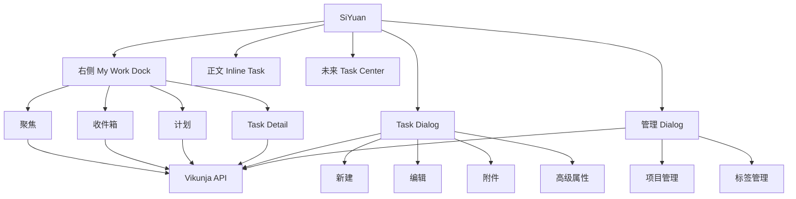
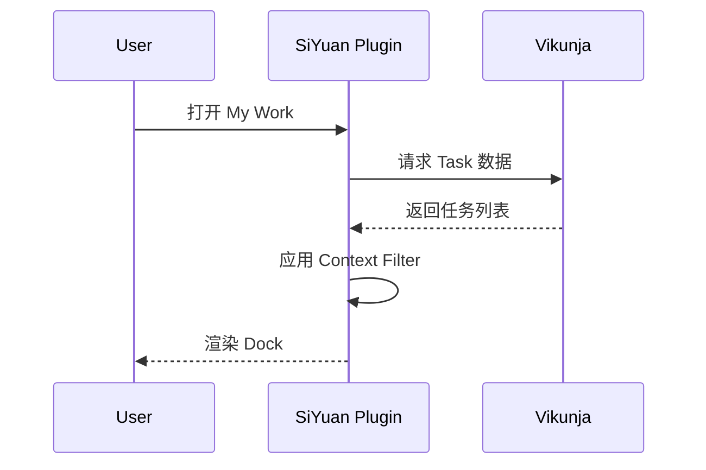
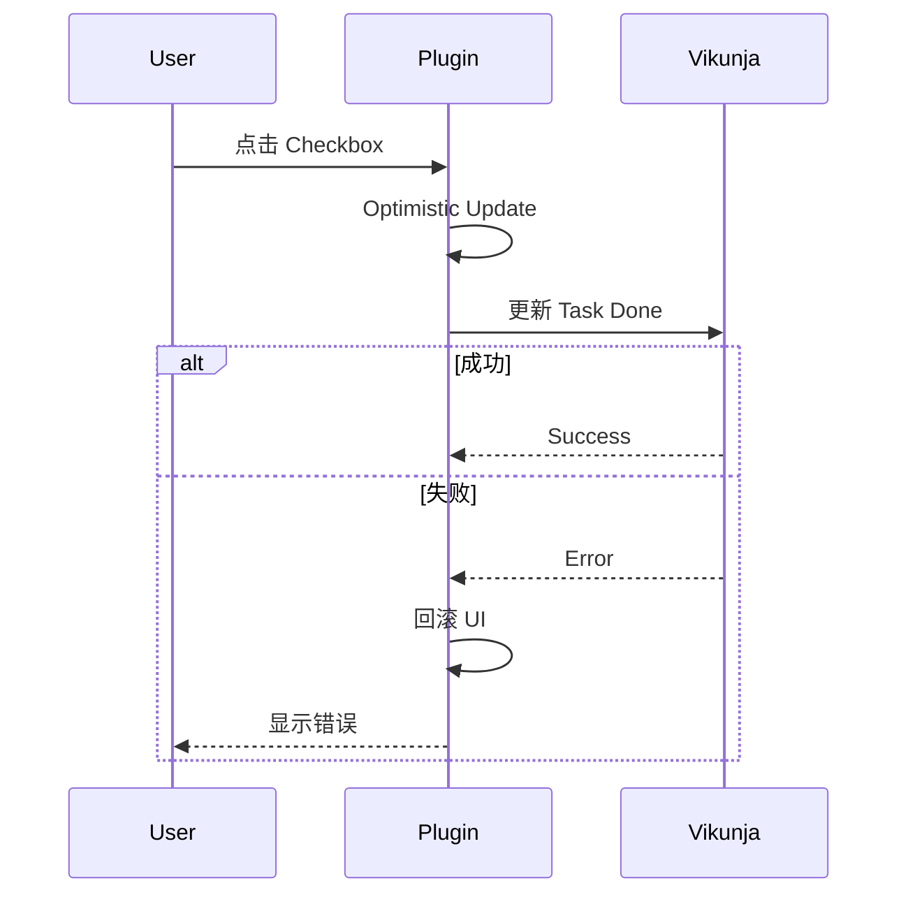
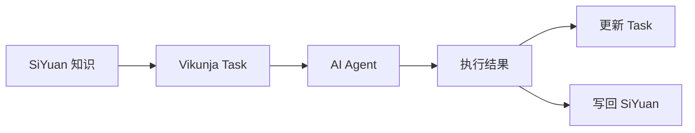

# SiYuan × Vikunja 任务插件需求与产品设计

> 版本：V0.4  
> 状态：原型设计阶段  
> 目标宿主：SiYuan Note  
> 任务后端：Vikunja  
> 配套原型：`siyuan-vikunja-v4-dialog-management.html`

---

# 1. 产品概述

## 1.1 产品定位

本插件不是“在 SiYuan 中复制一个 Vikunja Web”。

产品定位是：

> **以 SiYuan 作为工作上下文与知识空间，以 Vikunja 作为任务数据、项目组织和任务状态引擎，在 SiYuan 内完成高频任务捕获、执行、编辑、查看和上下文关联。**

用户在阅读、写作、设计、开发和复盘过程中，可以尽量不离开当前笔记完成任务相关操作。

---

## 1.2 产品目标

插件需要解决以下核心问题：

1. 用户在 SiYuan 中产生行动项时，可以快速创建 Vikunja Task。
2. 用户可以在 SiYuan 右侧 Dock 中知道“现在应该做什么”。
3. 用户可以完整查看和编辑任务，而不需要频繁打开 Vikunja Web。
4. 用户可以管理 Vikunja 项目和标签。
5. 用户可以为任务上传、查看、管理附件。
6. 用户可以将 Vikunja Task 与 SiYuan 文档、Block 建立关系。
7. Vikunja 保持任务的唯一事实来源，避免双向数据副本失控。
8. 对高级项目规划需求，允许后续提供 Task Center，而不是把所有能力塞入 Dock。

---

# 2. 产品设计原则

## 2.1 Vikunja 是任务 Source of Truth

任务本体由 Vikunja 保存：

- 标题
- 状态
- 项目
- 标签
- 优先级
- 截止时间
- 开始时间
- 提醒
- 重复规则
- 负责人
- 描述
- 评论
- 附件
- 任务关系

SiYuan 不维护完整任务副本。

SiYuan 只保存必要关联，例如：

```text
SiYuan Block ID
        ↓
Vikunja Task ID
```

推荐使用 SiYuan Block Attribute 或插件自有映射表保存关联信息。

---

## 2.2 SiYuan 提供 Context，而不是重新定义 Project

SiYuan 的价值不是创建另一套任务层级。

它提供的是：

- 当前文档
- 当前 Block
- 当前笔记本
- 引用上下文
- 项目设计文档
- 决策记录
- Daily Note
- 知识资料

因此：

```text
Vikunja
负责 Task / Project / Label / Workflow

SiYuan
负责 Knowledge / Context / Notes / Decisions
```

---

## 2.3 Dock 负责工作，不负责完整管理

右侧 Dock 的第一目标是：

> **现在做什么？**

而不是：

> Vikunja 中存在什么？

因此右侧 Dock 主要负责：

- 查看当前工作
- 完成任务
- 快速进入详情
- 新建任务
- 编辑任务
- 查看上下文
- 查看少量关键状态

复杂的批量管理、完整 Kanban、Table、Gantt 等能力不应该直接塞进 Dock。

---

## 2.4 新建和编辑统一使用 Dialog

任务涉及字段较多：

- 项目
- 标签
- 日期
- 负责人
- 优先级
- 描述
- 附件
- 提醒
- 重复
- 关系

不适合在 Dock 底部不断展开表单。

因此统一使用 Dialog：

```text
新建 Task
        ↓
Task Dialog

编辑 Task
        ↓
Task Dialog
```

Dock 保持稳定。

---

# 3. 产品信息架构



---

# 4. 核心导航设计

## 4.1 Dock 一级导航

建议使用：

```text
聚焦
收件箱
计划
```

而不是：

```text
文档
笔记本
工作空间
```

原因是 Dock 是工作面板，而不是数据浏览器。

---

## 4.2 聚焦

默认首页。

目标：

> 帮用户判断当前最需要处理的任务。

推荐分组：

```text
逾期
今天
下一步
```

示例：

```text
逾期 2

□ 修复任务同步失败重试
  逾期2天 · VCPDesk · #开发 · 📎2 · 💬3


今天 3

□ 完成插件原型
  21:00 · SiYuan Plugin · #设计


下一步 1

□ 设计评论和附件区
  明天 · SiYuan Plugin
```

---

## 4.3 收件箱

用于捕获尚未整理完成的 Task。

典型来源：

- 用户快速创建
- 从 SiYuan Block 创建
- AI 自动创建
- 外部系统导入
- 尚未设置项目
- 尚未设置日期
- 尚未设置标签

产品目标：

> 任务先进入系统，再整理。

---

## 4.4 计划

用于查看未来任务。

推荐时间分组：

```text
明天
本周
下周
以后
```

未来可增加日历模式。

---

# 5. 上下文过滤设计

SiYuan 上下文不作为一级导航。

应该作为 Filter：

```text
[当前笔记]
[分配给我]
[+ 条件]
```

例如：

```text
聚焦
+
当前笔记
```

得到：

> 当前这篇文档中，与今天工作相关的任务。

---

## 5.1 当前笔记

筛选所有与当前文档或文档内 Block 建立关联的任务。

---

## 5.2 当前 Block

当用户在正文中选中某个 Block 时，可以提供：

```text
查看关联 Task
创建 Task
关联已有 Task
解除关联
```

---

## 5.3 笔记本范围

可以作为高级过滤条件保留，但不建议占据 Dock 一级位置。

---

# 6. Task 列表设计

## 6.1 Task Row 信息层级

列表中不应该显示所有字段。

默认显示：

```text
完成状态
任务标题

截止时间
项目
关键标签
负责人
附件数量
评论数量
关系状态

优先级视觉提示
```

示例：

```text
□ 修复任务同步失败重试        │
  逾期2天 · VCPDesk · #开发
  📎2 · 💬3 · 🔗1
```

---

## 6.2 优先级

不建议使用大量 P1/P2/P3 Badge。

推荐：

- 高优先级：红色侧标
- 中优先级：橙色侧标
- 普通：弱灰色
- 无优先级：不强调

减少视觉噪音。

---

## 6.3 Hover Actions

默认不显示操作按钮。

Hover 后出现：

```text
编辑
稍后处理
更多
```

避免列表过度复杂。

---

# 7. Task Detail

点击列表 Task 后：

> Dock 原位置切换为 Task Detail。

而不是额外打开第四列。

---

## 7.1 Detail 基础区域

```text
任务标题
完成状态

优先级
截止时间
标签

项目
负责人
开始时间
截止时间
提醒
重复
```

---

## 7.2 Description

显示 Vikunja Task Description。

编辑时进入 Task Dialog。

---

## 7.3 Relations

支持展示任务关系，例如：

```text
Blocked by
Blocking
Related
Parent
Subtask
```

---

## 7.4 Attachments

附件是一等能力。

Task Detail 中直接显示：

```text
附件 · 2

📄 prototype-v4.html
184 KB

🖼 siyuan-layout.png
412 KB

+ 添加附件
```

支持：

- 查看
- 下载
- 删除
- 上传
- 显示文件类型
- 显示大小
- 显示上传时间

---

## 7.5 Comments

支持：

- 查看评论
- 新增评论
- 后续可支持编辑或删除

---

## 7.6 SiYuan Context

这是插件区别于 Vikunja Web 的核心能力。

示例：

```text
SiYuan 上下文

daily note
“项目、标签作为可管理对象……”

产品设计文档
“任务创建和编辑统一使用 Dialog……”
```

点击后跳转对应 Block。

---

# 8. Task Dialog

## 8.1 使用场景

统一用于：

- 新建任务
- 编辑任务
- 从 Block 创建任务
- AI 创建后补充信息

---

## 8.2 Dialog 信息架构

推荐布局：

```text
标题

项目            负责人

开始时间        截止时间        优先级

标签            重复

描述

────────────────────
附件
────────────────────

提醒            任务关系

☑ 关联当前 SiYuan Block

               取消      保存任务
```

---

## 8.3 标题

必填。

---

## 8.4 项目

从 Vikunja Projects 加载。

需要支持：

- 搜索
- 选择
- 快速创建项目
- 项目颜色显示

---

## 8.5 标签

支持：

- 多选
- 搜索
- 创建标签
- 标签颜色
- 删除选择

---

## 8.6 日期

支持：

- 开始时间
- 截止时间
- 全天
- 日期 + 时间

后续可支持自然语言输入。

---

## 8.7 提醒

支持 Vikunja Reminder 能力。

例如：

```text
不提醒
提前 10 分钟
提前 1 小时
提前 1 天
自定义
```

---

## 8.8 重复

支持：

```text
不重复
每天
每周
每月
自定义
```

---

## 8.9 描述

推荐 Markdown 编辑。

---

## 8.10 附件

必须支持：

- 点击上传
- 拖拽上传
- 上传状态
- 上传失败
- 删除附件
- 文件类型
- 大小显示

Dialog 中上传后立即进入 Task。

---

## 8.11 Task Relations

第一阶段可支持：

```text
关联
阻塞
被阻塞
父任务
子任务
```

---

# 9. 项目管理

项目必须作为正式管理对象。

入口：

```text
My Work
        ↓
⚙
        ↓
管理 Vikunja
        ↓
项目
```

---

## 9.1 项目列表

每个 Project 显示：

```text
颜色
项目名称
未完成数量
```

支持：

- 新建
- 编辑
- 删除
- 搜索
- 排序
- 后续支持父子项目

---

## 9.2 新建项目

字段建议：

```text
项目名称
颜色
描述
父项目
```

---

# 10. 标签管理

与项目同级。

入口：

```text
管理 Vikunja
        ↓
标签
```

每个 Label 显示：

```text
颜色
名称
使用任务数量
```

支持：

- 新建
- 编辑
- 删除
- 搜索

---

# 11. 正文 Inline Task

正文中的 Task 不应该成为复杂卡片。

推荐：

```text
□ 完成 V4 任务管理原型      P2   今天
```

Hover 后：

```text
□ 完成 V4 任务管理原型      P2   今天    ⋯
```

点击：

```text
打开右侧 Task Detail
```

点击 Checkbox：

```text
直接更新 Vikunja Task Done
```

---

# 12. 从 SiYuan 创建 Task

支持多个入口。

---

## 12.1 Block Menu

```text
Block 右键
        ↓
Vikunja
        ├─ 创建任务
        ├─ 关联已有 Task
        ├─ 查看关联任务
        └─ 解除关联
```

---

## 12.2 选中文字

例如：

```text
需要重构同步失败重试逻辑
```

选择文字：

```text
创建 Vikunja Task
```

Dialog 自动填入：

```text
标题：
需要重构同步失败重试逻辑
```

---

## 12.3 Slash Command

未来建议：

```text
/vikunja
/todo
/task
```

---

# 13. 项目与 SiYuan 的关系

不建议强制：

```text
SiYuan Notebook = Vikunja Project
```

因为两边信息组织目的不同。

应该允许用户手动映射：

```text
SiYuan Notebook
      ↓
默认 Vikunja Project
```

例如：

```text
SiYuan：
光缆运维系统

默认 Task Project：
OTDR
```

这样在该笔记本中新建任务时自动选择 OTDR。

---

# 14. 数据模型建议

插件本地只保存辅助关系。

推荐：

```ts
interface TaskLink {
  taskId: number
  blockId: string
  documentId: string
  notebookId?: string

  createdAt: number
}
```

---

## 14.1 Block Attribute

推荐额外写入：

```text
custom-vikunja-task-id
```

优点：

- SiYuan 同步后关系仍然存在
- 换机器后可以恢复
- Block 与 Task 关系不完全依赖本机数据库

---

# 15. 同步策略

## 15.1 原则

Vikunja Task：

```text
Vikunja → Source of Truth
```

SiYuan：

```text
保存关联关系
```

---

## 15.2 Dock 打开

流程：



---

## 15.3 完成任务



---

# 16. API Adapter 层建议

不要让 UI 直接请求 Vikunja API。

增加：

```text
VikunjaClient
```

统一封装：

```ts
getTasks()
getTask()
createTask()
updateTask()
completeTask()

getProjects()
createProject()
updateProject()
deleteProject()

getLabels()
createLabel()
updateLabel()
deleteLabel()

getAttachments()
uploadAttachment()
deleteAttachment()

getComments()
createComment()

getRelations()
createRelation()
```

这样后续：

- API 版本变化
- 鉴权变化
- Mock
- 测试

都不影响 UI。

---

# 17. 缓存设计

建议缓存：

```text
Projects
Labels
Task Summary
Saved Filters
```

不建议长期缓存完整任务作为第二事实来源。

---

# 18. 错误处理

## 18.1 API 不可用

Dock 显示：

```text
无法连接 Vikunja

[重新连接]
```

不要让整个 SiYuan 卡死。

---

## 18.2 更新失败

例如完成任务失败：

```text
更新失败，已恢复原状态

[重试]
```

---

## 18.3 附件失败

显示：

```text
upload.png
上传失败

[重试] [删除]
```

---

# 19. Empty State

不同 Empty State 需要不同文案。

---

## 聚焦为空

```text
今天没有需要处理的任务
```

---

## 当前笔记没有 Task

```text
当前笔记还没有关联任务

[新建任务]
```

---

## 项目为空

```text
暂无项目

[创建第一个项目]
```

---

# 20. 快捷键建议

第一阶段建议：

```text
Alt + T
新建 Task

Alt + Shift + T
将当前 Block 创建为 Task
```

具体快捷键应允许用户配置。

---

# 21. 权限与配置

插件设置至少包括：

```text
Vikunja URL
API Token / Authentication
默认项目
默认负责人
任务刷新间隔
是否自动关联当前 Block
附件上传限制
```

---

# 22. 设置页

建议：

```text
Vikunja

连接状态：
● 已连接

Server
https://...

Account
xuzhen

默认项目
SiYuan Plugin

────────────────

行为

☑ 创建任务默认关联当前 Block
☑ 完成 Task 后隐藏
☑ 启动时刷新任务
```

---

# 23. 第一阶段 MVP

必须实现：

- Vikunja 连接
- Task List
- 聚焦
- 收件箱
- 计划
- 新建 Task Dialog
- 编辑 Task Dialog
- 完成 Task
- Project 获取和选择
- Project 管理
- Label 获取和选择
- Label 管理
- Attachment 上传
- Attachment 查看
- Attachment 删除
- 当前 Block 关联
- Task Detail
- 基础错误处理

---

# 24. 第二阶段

增加：

- Comments
- Relations
- Repeat
- Reminder
- Saved Filters
- Block Menu
- Slash Command
- Task Search
- Notebook → Project 默认映射
- 更完整 Context Filter

---

# 25. 第三阶段

增加 Task Center：

```text
List
Table
Kanban
Calendar
```

用于：

- 项目级管理
- 批量操作
- 规划
- Saved Filters

不建议第一阶段实现 Gantt。

---

# 26. AI Agent 扩展方向

未来 Task 可以成为 AI Agent 的工作单元。

Agent 获取：

```text
Task
+
SiYuan Context
+
Project Context
+
Related Blocks
```

形成：



这将使插件从 Todo Integration 演进为：

> **Knowledge → Action → Execution → Knowledge**

的工作闭环。

---

# 27. 推荐代码模块

```text
src/

api/
  vikunja-client.ts
  task-api.ts
  project-api.ts
  label-api.ts
  attachment-api.ts

services/
  task-service.ts
  context-service.ts
  sync-service.ts
  cache-service.ts

components/
  MyWorkDock/
  TaskList/
  TaskRow/
  TaskDetail/
  TaskDialog/
  ProjectManager/
  LabelManager/
  AttachmentList/

siyuan/
  block-link.ts
  block-menu.ts
  slash-command.ts

store/
  task-store.ts
  project-store.ts
  label-store.ts

settings/
  settings-view.ts
```

---

# 28. 核心状态

推荐 Task UI 状态：

```ts
type TaskUIState =
  | "loading"
  | "ready"
  | "empty"
  | "error"
  | "saving"
```

Dialog：

```ts
type DialogMode =
  | "create"
  | "edit"
```

---

# 29. 验收标准

## Task

用户必须可以：

- 创建任务
- 修改标题
- 修改项目
- 修改标签
- 修改日期
- 修改优先级
- 修改负责人
- 修改描述
- 上传附件
- 删除附件
- 完成任务

---

## Project

用户必须可以：

- 查看项目
- 创建项目
- 编辑项目
- 删除项目
- 在 Task 中选择项目

---

## Label

用户必须可以：

- 查看标签
- 创建标签
- 编辑标签
- 删除标签
- Task 多选标签

---

## SiYuan Context

用户必须可以：

```text
Block → Task
Task → Block
```

双向找到对应对象。

---

# 30. 产品最终边界

最终需要始终坚持：

```text
SiYuan 不是 Vikunja 的替代品。

Vikunja 也不是 SiYuan 的知识系统。
```

两者关系：

```text
SiYuan
Knowledge / Context / Thinking

            ↓

Vikunja Plugin
Action Layer

            ↓

Vikunja
Task / Project / Workflow
```

这是整个产品架构最重要的设计边界。

---

# 31. 当前推荐交互总结

```text
                    SiYuan

正文
│
├─ Inline Task
│
└─ Block
     │
     └─ 创建 / 关联 Task

右侧 My Work
│
├─ 聚焦
├─ 收件箱
├─ 计划
│
├─ Task List
│
└─ Task Detail
     │
     └─ 编辑
          ↓
      Task Dialog

管理
│
├─ Projects
└─ Labels

                         ↓

                     Vikunja API
```

---

# 32. 原型对应关系

当前 V4 HTML 原型主要覆盖：

- SiYuan 宿主布局
- My Work Dock
- 聚焦 Task List
- Task Detail
- 新建 Task Dialog
- 编辑 Task Dialog
- Attachment
- Project Manager
- Label Manager
- Inline Task

建议后续开发时优先按照本需求文档拆模块，而不是直接按照 HTML DOM 结构照搬。

HTML 原型负责：

> 表达交互和信息架构。

本文件负责：

> 表达产品设计、功能边界和实现要求。
